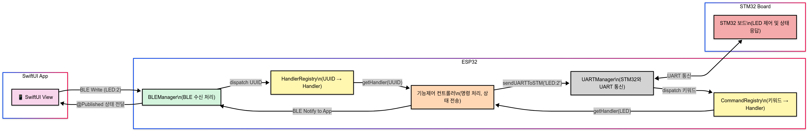

# ESP 통신 아키텍처 및 모듈화 설

상태: 시작 전
태그: 정운관



## 파일구조

```c
📁 /ESP32/CCC
├── CCC.ino                          ← 메인 진입점 (setup/loop)
│
├── BLEManager.h / .cpp             ← BLE 초기화, 데이터 수신, 앱으로 데이터 전송
├── UARTManager.h / .cpp            ← UART1 초기화, STM32와 데이터 송수신
│
├── CommandHandler.h                ← 모든 핸들러가 구현하는 공통 인터페이스
├── CommandRegistry.h               ← UART용: 키워드 기반 핸들러 매핑 ("LED" → 핸들러)
├── HandlerRegistry.h               ← BLE용: UUID 기반 핸들러 매핑 (UUID → 핸들러)
│
├── Handlers.h / .cpp               ← 핸들러 인스턴스 생성 및 BLE/UART에 등록
│
├── LEDController.h / .cpp          ← LED 관련 핸들러. BLE/UART 명령 처리, 상태 전송
├── MP3Controller.h / .cpp          ← MP3 관련 핸들러 (예정 또는 구현 중)
├── AirconController.h / .cpp       ← 에어컨 관련 핸들러 (예정 또는 구현 중)
```

---

## 모듈화 이유

### ✅ 역할 기반 분리 (Separation of Concerns)

- BLE / UART / 명령 처리 / 기능 제어를 각 파일에서 분리하여 **가독성**, **유지보수성**, **디버깅** 효율 증가

### ✅ 핸들러 기반 구조 (확장성 강화)

- 기능 컨트롤러(`LEDController`, `MP3Controller`, `AirconController` 등)는 공통 인터페이스 `CommandHandler`를 상속
- BLE는 UUID 기반, UART는 키워드 기반으로 라우팅하여 **유연한 기능 확장** 가능

### ✅ 객체지향 구조 설계 (현실 시스템에 유사)

- 실제 임베디드 소프트웨어 아키텍처와 유사하게 구성
- 테스트 가능하고, 유지보수 가능한 구조 지향

---

## Manager

BLEManager와 UARTManager는 각각 통신 초기화, 이벤트 감지, 데이터 전송 등 **저수준 하드웨어 통신을 담당하는 책임 단위**입니다.

| Manager | 역할 | 이유 |
| --- | --- | --- |
| BLEManager | BLE 초기화, 특성 등록, 데이터 수신/전송 | BLE 통신 로직을 한 곳에서 관리하여 재사용성과 독립성 확보 |
| UARTManager | UART 설정, 수신 이벤트 처리, STM32와 데이터 송수신 | UART 처리를 별도로 분리함으로써 로직과 통신 코드를 분리함 |

Manager가 없다면 `.ino` 파일이 BLE와 UART 설정, 이벤트 처리, 데이터 파싱 등으로 복잡해져 유지보수가 어려워집니다

---

## Handler

BLE 또는 UART를 통해 수신된 명령은 각각의 **기능 컨트롤러(LED, MP3, Aircon 등)** 로 전달되어야 합니다. 이를 일일이 `if/else`로 처리하는 방식은 다음과 같은 문제를 가집니다:

- 기능이 늘어날수록 코드 복잡도 급증
- 유지보수/확장 시 매번 수정 필요
- 테스트/디버깅이 어렵고 재사용이 어려움

👉 이를 해결하기 위해, `CommandHandler`라는 인터페이스를 만들고 기능별 핸들러가 이를 상속하여 **공통 인터페이스 기반의 분기 처리**가 가능하도록 했습니다.

핸들러 구조의 이점:

- 기능별 로직 독립 구성 가능
- BLE와 UART 모두에서 재사용 가능
- 등록/분기 구조 덕분에 새로운 기능 추가가 간단 (OCP 적용)

---

## **Controller**

Controller는 실제로 특정 기능을 제어하거나 상태를 반환하는 **핵심 비즈니스 로직을 담당**합니다. 예를 들어 `LEDController`는 "LED:1" 명령을 받아 STM으로 전송하고, "LED:2" 요청이 들어오면 현재 상태를 BLE를 통해 앱으로 전달합니다.

| Controller | 역할 | 예시 동작 |
| --- | --- | --- |
| LEDController | LED 상태 제어 및 상태 요청 처리 | "LED:1" → ON, "LED:2" → 상태 요청 응답 |
| MP3Controller | MP3 재생, 정지, 다음 곡 등 제어 | "MP3:PLAY" → 재생 시작 |
| AirconController | 에어컨 온/오프, 온도 설정, 상태 요청 등 처리 | "AIRCON:ON" → 에어컨 전원 켜기 |

Controller가 없다면 모든 로직이 핸들러 또는 매니저에 분산되면서 코드의 응집력이 떨어지고 기능 단위 테스트도 어려워집니다.

➡️ Controller는 **기능 단위 책임 분리**, **재사용성 확보**, **기능 확장에 유리한 구조**를 제공합니다.